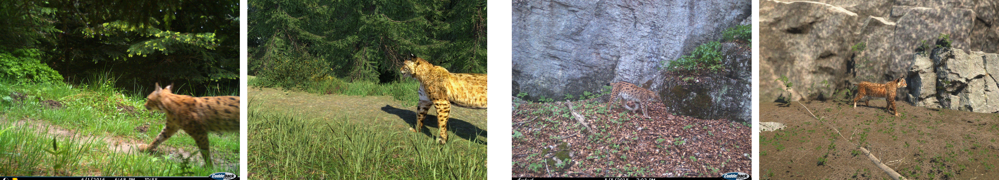

# WildLife Synthetic

WildLife Synthetic is a Unity-based pipeline for generating camera-trap–style wildlife images with full ground-truth labels. It was originally built for the [CzechLynx Dataset](https://arxiv.org/pdf/2506.04931) and currently targets the Eurasian lynx (*Lynx lynx*), but the same setup can be reused for other species as long as a rigged 3D model, textures, and a few animations are available.

---

## What it does

WildLife Synthetic turns a small set of Unity scenes and a rigged animal model into a labeled dataset, with individual identification as the main target task. In a single run, it:

- Varies **individual identity** by swapping coat textures, so one 3D model represents many distinct animals.
- Renders **camera-trap–style images** in photorealistic environments (forest, snow, different viewpoints).
- Exports **identity labels**, **pose keypoints**, **instance masks**, and **bounding boxes** directly from the 3D engine.
- Controls variability through a simulation loop that moves the animal along paths, samples random stop points, and changes pose, texture, and scene details.

The result is data that look like camera-trap photos but come with exact individual IDs and dense labels for pose and segmentation.

---

## Where to start

Most people land here with one of two goals:

- *“I just want synthetic lynx data for my models.”*  
- *“I want to reuse this for a different species.”*

If you only need **synthetic lynx data** (for re-ID, pose, or segmentation):

1. Go to [**Installation & setup**](getting-started/setup.md) and follow it once to prepare the Unity project.  
2. Then follow [**First run (lynx)**](getting-started/quickstart.md) to:
   - open one of the prepared lynx scenes,
   - run a short simulation,
   - and inspect the images and JSON files written to the output folder.  
3. After that, use the pages under [**Generating data**](generating/pipeline_overview.md) to:
   - increase the number of frames,
   - change the capture interval,
   - and point the output to a dedicated folder for your experiments.

If you plan to **adapt the pipeline to another species**:

1. Still start with [**Installation & setup**](getting-started/setup.md) and [**First run (lynx)**](getting-started/quickstart.md) to make sure the pipeline works end-to-end on your machine.  
2. Then read the [**Lynx configuration**](lynx-config/data_labels.md) pages to see how the lynx model, keypoints, textures, and environments are wired together.  
3. Finally, follow [**Adapting to other species**](adapting/adapting_overview.md) to:
   - swap the lynx mesh for your own rigged model,
   - redefine keypoints if needed,
   - and generate a new set of textures and identities.

Once you can run the lynx setup and understand where the outputs are written, the rest of the documentation is about changing *what* is in the scene, not *how* the pipeline works.